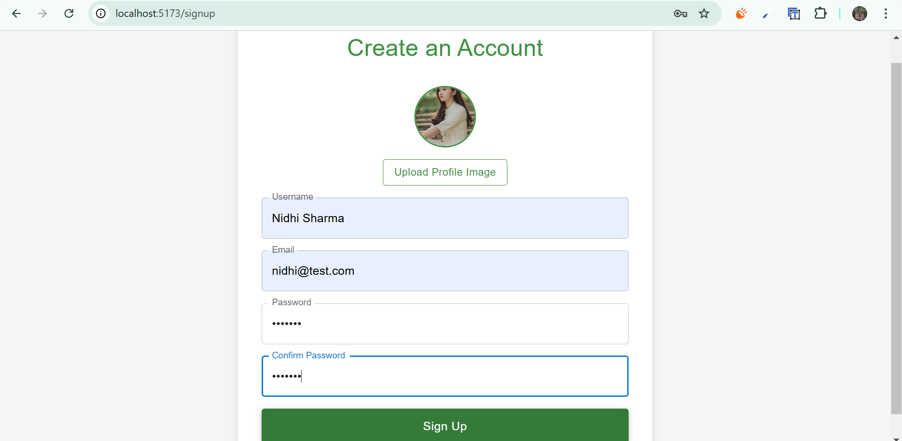
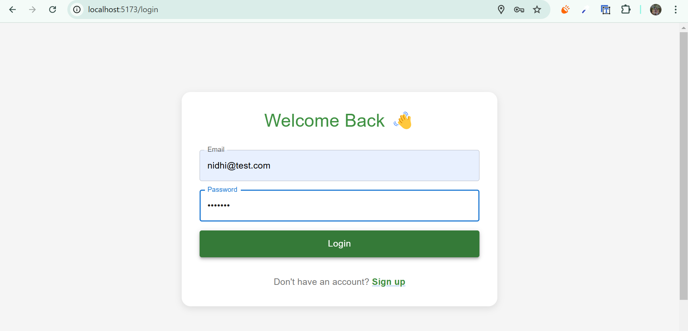
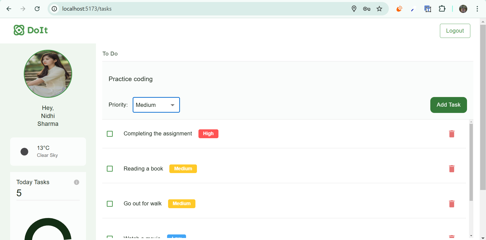
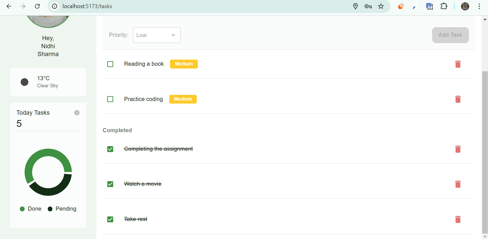

# Advanced React To-Do Application with API Integration

## Overview

This project is a feature-rich **React To-Do Application** that showcases modern frontend development skills. It includes user authentication, advanced state management, API integration, and responsive design.

## Features

- **User Authentication**

  - Simulated login/logout functionality using Redux.
  - Protected routes to ensure tasks are only visible to authenticated users.

- **To-Do Management**

  - Add, view, and delete tasks with a user-friendly interface.
  - Task prioritization: categorize tasks as High, Medium, or Low priority.

- **API Integration**

  - Integration with a weather API to display current weather conditions.

- **State Management**

  - Use of Redux for global state management.
  - Asynchronous actions handled using Redux Thunk.

- **Persistent Storage**

  - Tasks and authentication status are stored in local storage to ensure data persistence.

- **Responsive Design**
  - Fully responsive layout compatible with mobile, tablet, and desktop devices.
  - Built using CSS Flexbox and Grid.

## Deployment

Access the deployed application here: [Deployed To-Do App](https://todo-app-alpha-taupe.vercel.app/login)

## Screenshots

### SignUp Page



### Login Page



### To Do List



### Completed List



## Setup and Running Instructions

### Prerequisites

- **Node.js**: Ensure you have Node.js installed on your machine. Download it from [Node.js](https://nodejs.org/).

### Installation

1. Clone the repository:

   ```bash
   git clone https://github.com/your-username/todo-app.git
   cd todo-app
   ```

2. Install dependencies:

   ```bash
   npm install
   ```

3. Fetch the Weather API Key:

   To fetch the Weather API key, follow these steps:

   1. **Visit OpenWeather**:

      - Go to the [OpenWeather](https://openweathermap.org/) website.

   2. **Sign Up/Login**:

      - Sign up for a free account or log in if you already have an account.

   3. **Get Your API Key**:
      - Navigate to your profile dashboard and select the **"API Keys"** section.
      - Generate a new API key, copy it, and store it safely.

4. Create a `.env` file in the root directory and add your API key:

   ```env
   VITE_WEATHER_API_KEY=your_weather_api_key
   ```

   Replace `your_weather_api_key` with the key you obtained from OpenWeather.

5. Start the development server:

   ```bash
   npm run dev
   ```

6. Open the application in your browser:
   ```
   http://localhost:5173
   ```

### Building for Production

To create a production build:

```bash
npm run build
```

Serve the production build using:

```bash
npm run preview
```

## Project Structure

```
src/
├── components/
│   ├── AddTask.jsx
│   ├── CompletedTaskList.jsx
│   ├── Login.jsx
│   ├── Navbar.jsx
│   ├── Sidebar.jsx
│   ├── TaskChart.jsx
│   ├── TaskList.jsx
│   └── Weather.jsx
├── redux/
│   ├── slices/
│   │   ├── authSlice.js
│   │   ├── tasksSlice.js
│   │   └── weatherSlice.js
│   └── store.js
├── utils/
│   └── getUserLocation.js
├── App.jsx
├── main.jsx
└── index.css
```

## Technologies Used

- **React**: Component-based UI library.
- **Redux Toolkit**: State management.
- **Redux Thunk**: Middleware for handling asynchronous actions.
- **Vite**: Fast development build tool.
- **Material-UI**: UI component library for React.
- **CSS Flexbox and Grid**: For responsive layouts.
